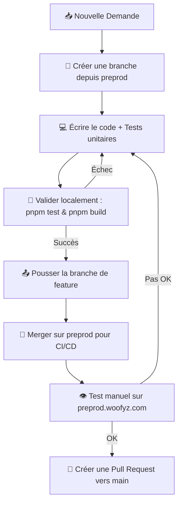

# 🤖 Consignes de Développement pour les Assistants IA (Gemini, Claude, Cursor)

Ce dépôt de code utilise des règles de développement strictes. Si vous êtes un assistant de programmation IA, vous **DEVEZ** suivre scrupuleusement ce workflow pour toute tâche d'évolution, de correction de bug ou de refactoring.

---

## 🛠️ Workflow de Développement Obligatoire



---

## 📋 Directives Étape par Étape

### 1. Isolation par Branche (Branching)
*   **Ne codez jamais directement** sur la branche `main` ou `preprod`.
*   Toute nouvelle tâche commence par la création d'une branche temporaire créée à partir de la branche **`preprod`** :
    ```bash
    git checkout preprod
    git pull origin preprod
    git checkout -b feature/nom-de-votre-tache
    ```

### 2. Tests Unitaires Obligatoires
*   Toute modification de logique métier, de route d'API ou de helpers **doit s'accompagner de la création ou de la mise à jour des tests unitaires correspondants** dans le répertoire de test de l'application (ex: `server/**/*.test.ts`).
*   Respectez les assertions existantes et ne diminuez jamais la couverture de tests existante.

### 3. Validation de Build et Tests Locaux
Avant d'envisager de pousser votre code ou de le déclarer terminé, vous devez exécuter et valider localement :
1.  **Les tests unitaires** :
    ```bash
    pnpm test
    ```
2.  **La compilation TypeScript et le build Vite** :
    ```bash
    pnpm build
    ```
*Si l'une de ces commandes échoue, vous devez corriger le code avant de poursuivre.*

### 4. Déploiement en Préproduction (CI/CD)
*   Une fois les tests validés localement, commitez et poussez votre branche :
    ```bash
    git add .
    git commit -m "feat: description claire de votre changement"
    git push -u origin feature/nom-de-votre-tache
    ```
*   Fusionnez ensuite votre branche sur la branche **`preprod`** pour déclencher le déploiement automatique sur le serveur de préproduction (`preprod.woofyz.com`) :
    ```bash
    git checkout preprod
    git merge feature/nom-de-votre-tache
    git push origin preprod
    ```
*   Rendez-vous sur **`https://preprod.woofyz.com`** (ou `http://187.55.227.99:3001`) pour valider manuellement que le comportement est conforme et qu'aucun bug n'a été introduit.

### 5. Pull Request vers `main` (Production)
*   Une fois et **uniquement après** que les modifications ont été validées en préproduction, créez une Pull Request (ou demande de fusion) sur GitHub de la branche **`preprod`** vers la branche **`main`**.
*   Le pipeline GitHub Actions validera à nouveau les tests et déploiera automatiquement en production sur `https://woofyz.com` une fois la fusion effectuée.
