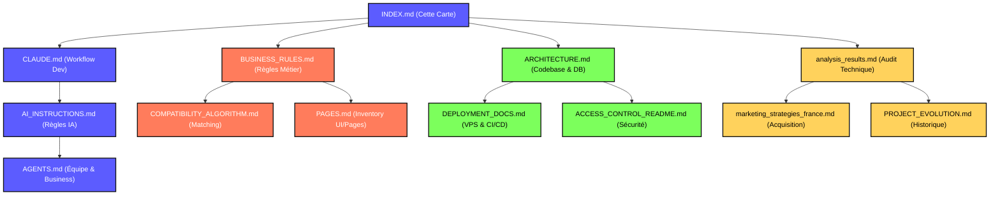

# 🐾 Woofyz Obsidian Vault Index

Bienvenue dans le coffre (Vault) de documentation de **Woofyz**. Ce document sert de carte d'orientation pour naviguer à travers l'architecture technique, les règles métier, les processus de déploiement et les plans de lancement.

---

## 🗺️ Carte d'Orientation (Graph Diagram)

---

## 📂 Navigation par Thématique

### 🛠️ Général & Développement
- **[[CLAUDE]]** : Le guide de référence pour le workflow de développement obligatoire (branches, commits, tests, commandes PM2).
- **[[AI_INSTRUCTIONS]]** : Directives spécifiques pour les assistants de programmation IA (Gemini, Claude, Cursor).
- **[[AGENTS]]** : Configuration de l'équipe d'agents de lancement et architecture financière/grille de tarifs.

### 📐 Spécifications & Règles Métier
- **[[BUSINESS_RULES]]** : Description précise de la logique métier (authentification, swipes, messagerie, webhooks n8n, stubs).
- **[[COMPATIBILITY_ALGORITHM]]** : Fonctionnement complet de l'algorithme de compatibilité Chien-Chien (B2C) et Chien-Sitter (B2B).
- **[[PAGES]]** : Inventaire de toutes les pages/routes de l'application et les actions utilisateur possibles.

### 🏗️ Architecture, Sécurité & Déploiement
- **[[ARCHITECTURE]]** : Arborescence complète du projet, stack technique, et structure des tables Drizzle / SQL brut.
- **[[DEPLOYMENT_DOCS]]** : Architecture VPS, configurations Nginx/Docker/PM2, variables d'environnement, et pipelines CI/CD.
- **[[docs/ACCESS_CONTROL_README|ACCESS_CONTROL_README]]** : Guide d'utilisation du système de restriction d'accès aux fichiers critiques.

### 📈 Lancement & Analyse Stratégique
- **[[docs/analysis_results|analysis_results]]** : Rapport technique initial et structure générale du projet.
- **[[docs/marketing_strategies_france|marketing_strategies_france]]** : Stratégie de Guerilla Marketing et d'acquisition de micro-influence avec un budget lean de 200 €.
- **[[docs/PROJECT_EVOLUTION|PROJECT_EVOLUTION]]** : Historique des modifications majeures apportées au projet Woofyz.
